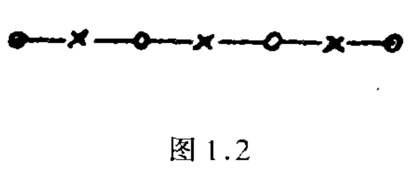

[原文PDF](https://eanyang7.github.io/Probability-and-Statistics/assets/1/1.2.pdf)

#  1.2 古典概率计算

## 1.2.1 排列组合的几个简单公式

按公式(1.1)，古典概率计算归结为计算两个数M和N。这种计算大多涉及**排列组合**。二者的区别在于，**排列要计较次序而组合不计较**：ab和ba是不同的排列，但是是相同的组合。

1.n个相异物件取r个(1≤r≤n)的不同**排列总数**，为

$$P=n(n-1)(n-2)…(n-r+1)\tag{2.1}$$

???+ info "注意"

    1.最后一项$(n-r+1)$表示为$[n-(r-1)]$。
    
    2.拓展：化简
    
    $\begin{aligned}
    \mathrm{A}_n^m & =n(n-1)(n-2) \ldots[n-(m-1)] \\
    & =n(n-1)(n-2) \ldots(n-m+1) \\
    & =\frac{n(n-1)(n-2) \ldots(n-m+1)(n-m)(n-m-1) \ldots 2 \times 1}{(n-m)(n-m-1) \ldots 2 \times 1} \\
    & =\frac{n !}{(n-m) !}
    \end{aligned}$

因为，从n个中取出排列中的第1个，有n种取法。在剩下的n-1个中取出一个，作为排列中的第2个，有n-1种取法….最后，在剩下的n-r+1个中取出一个作为排列中的第r个，有n-r+1种取法。因此不同的取法数目为n,n-1，…，n-r+1这r个数之积，从而得出公式(2.1)。

例如，从a,b,c,d这4个文字中取两个作排列，有4×3=12种：

$ab,ba,ac,ca,ad,da,bc,cb,bd,db,cd,dc$

特别，若n=r,由(2.1)得

$$P_{r}^{r}=r(r-1) \cdots 1=r !\tag{2.2}$$

r!读为“r阶乘”，是前r个自然数之积。人们常约定把0！作为1。当r是负整数时，记号r！没有意义。

2.n个相异物件取r个(1≤r≤n)的不同**组合总数**，为

$$C_{n}^{r}=P_{n}^{r} / r !=n ! /(r !(n-r) !)\tag{2.3}$$

因为，每一个包含r物件的组合，可以产生r!个不同的排列。故排列数应为组合数的r!倍，由此得出公式(2.3)。$C_{n}^{r}$常称为组合系数。

???+ info "详解"

    组合数不考虑物件的顺序，因此需要消除排列数中重复计数的部分。
    由于每一个包含 r 个物件的组合可以产生 r! 个不同的排列，我将总的排列数 P 除以 r!，以消除重复计数。

例如，从a,b,c,d这4个文字中取2个作组合。有4!/(2!2!)=6种，即ab,ac,ad,bc,bd,cd。

在有些书籍中把记号$C_{n}^{r}$写为$C_{r}^{n}$，$C_{n}^{r}$的一个更通用的记号是$\left(\begin{array}{l}
n \\
r
\end{array}\right)$。我们今后将用$\left(\begin{array}{l}
n \\
r
\end{array}\right)$取代$C_{n}^{r}$。当r=0时，按0！=1之约定，由(2.3)算出这可看作一个约定，对组合系数另一常用的
(2.3)算出$\left(\begin{array}{l}
n \\
0
\end{array}\right)=1$，这可看作一个约定。对组合系数另一常用的约定是：按公式

$$\left(\begin{array}{l}
n \\
r
\end{array}\right)=n(n-1) \cdots(n-r+1) / r !$$

只要r为非负整数，n不论为任何实数，都有意义。故可不必限制为自然数。例如，按上式，有

$$\left(\begin{array}{r}
-1 \\
r
\end{array}\right)=(-1)(-2) \cdots(-r) / r !=(-1)^{r}$$

3.与二项式展开的关系
组合系数$\left(\begin{array}{l}
n \\
r
\end{array}\right)$又常称为二项式系数，因为它出现在下面熟知的二项式展开的公式中：

$$(a+b)^{n}=\sum_{i=0}^{n}\left(\begin{array}{l}
n \\
i
\end{array}\right) a^{i} b^{n-i}\tag{2.4}$$

这个公式的证明很简单：因为$( a + b ) ^ { n } = ( a + b ) \cdot ( a + b ) \cdots ( a + b )$。为了产生$a^{i} b^{n-i}$这一项，在这$n$个$(a+b)$中, 要从其中的 $i$ 个取出 $a$, 另 $n-i$ 个取出 $b$. 从 $n$ 个中取出 $i$ 个的不同取法为 $\left(\begin{array}{l}n \\ i\end{array}\right)$, 这也就是 $a^{i} b^{n-i}$ 这一项的系数.

利用关系 (2.4) 可得出许多有用的组合公式. 例如,在 (2.4)中令 $a=b=1$, 得

$$
\left(\begin{array}{l}
n \\
0
\end{array}\right)+\left(\begin{array}{l}
n \\
1
\end{array}\right)+\cdots+\left(\begin{array}{l}
n \\
n
\end{array}\right)=2^{n}
$$

令 $a=-1, b=1$, 则得

$$
\left(\begin{array}{l}
n \\
0
\end{array}\right)-\left(\begin{array}{l}
n \\
1
\end{array}\right)+\left(\begin{array}{l}
n \\
2
\end{array}\right)-\cdots+(-1)^{n}\left(\begin{array}{l}
n \\
n
\end{array}\right)=0
$$

另一个有用的公式是

$$
\left(\begin{array}{c}
m+n \\
k
\end{array}\right)=\sum_{i=0}^{k}\left(\begin{array}{l}
m \\
i
\end{array}\right)\left(\begin{array}{c}
n \\
k-i
\end{array}\right)\tag{2.5}
$$

它是由恒等式 $(1+x)^{m+n}=(1+x)^{m}(1+x)^{n}$ 即

$$
\sum_{j=0}^{m+n}\left(\begin{array}{c}
m+n \\
j
\end{array}\right) x^{j}=\sum_{j=0}^{m}\left(\begin{array}{l}
m \\
j
\end{array}\right) x^{j} \sum_{j=0}^{n}\left(\begin{array}{l}
n \\
j
\end{array}\right) x^{j}
$$

比较两边的 $x^{k}$ 项的系数得到的.

4.$n$ 个相异物件分成 $k$ 堆,各堆物件数分别为 $r_{1}, \cdots, r_{k}$ 的分法是

$$
n ! /\left(r_{1} ! \cdots r_{k} !\right)\tag{2.6}
$$

此处 $r_{1}, \cdots, r_{k}$ 都是非负整数, 其和为 $n$, 又这里要计较堆的次序. 就是说, 若有 5 个物体 $a, b, c, d, e$ 分成 3 堆, 则 $(a c),(d),(b e)$ 和 $(b e),(a c),(d)$ 是算作两种不同分法.

证明很简单: 先从 $n$ 个中取出 $r_{1}$ 个作为第 1 堆, 取法有 $\left(\begin{array}{c}n \\ r_{1}\end{array}\right)$ 种. 在余下的 $n-r_{1}$ 个中取出 $r_{2}$ 个作为第 2 堆, 取法有 $\left(\begin{array}{c}n-r_{1} \\ r_{2}\end{array}\right)$ 种, 以此类推,得到全部不同的分法为

$$
\left(\begin{array}{c}
n \\
r_{1}
\end{array}\right)\left(\begin{array}{c}
n-r_{1} \\
r_{2}
\end{array}\right)\left(\begin{array}{c}
n-r_{1}-r_{2} \\
r_{3}
\end{array}\right) \cdots\left(\begin{array}{c}
n-r_{1}-r_{2}-\cdots-r_{k-1} \\
r_{k}
\end{array}\right)
$$

利用公式 (2.3) 并注意 $n-r_{1}-\cdots-r_{k-1}=r_{k}$, 即得 (2.6)

(2.6) 常称为多项式系数, 因为它是 $\left(x_{1}+\cdots+x_{k}\right)^{n}$ 的展开式 中, $x_{1}^{r} \cdots x_{k^{k}}^{r}$ 这一项的系数.

## 1.2. 2 古典概率计算举例

**例 2.1** 一批产品共 $N$ 个, 其中废品有 $M$ 个. 现从中随机 (或说随意) 取出 $n$ 个, 问 “其中恰好 $m$ 个废品” 这个事件 $E$ 的概率是多少?

按 1.2.1 所述, 从 $N$ 个产品中取出 $n$ 个, 不同的取法有 $\left(\begin{array}{l}N \\ n\end{array}\right)$ 种. 所谓“随机”或 “随意” 取, 是指这 $\left(\begin{array}{l}N \\ n\end{array}\right)$ 种取法有等可 性. 这是古典概率定义可以使用的前提. 所以, 从实际的角度言, 问题在于怎样保证抽取的方法能满足等可能性这个要求. 以下各例中“随机”一词也都是作这种理解。

使事件 $E$ 发生的取法, 或者说“有利”于事件 $E$ 的取法, 计算如下: 从 $M$ 个废品中取 $m$ 个, 取法有 $\left(\begin{array}{l}M \\ m\end{array}\right)$ 种. 从其余 $N-M$ 个合 格品中取 $n-m$ 个, 取法有 $\left(\begin{array}{c}N-M \\ n-m\end{array}\right)$ 种. 故有利于事件 $E$ 的取法, 共有 $\left(\begin{array}{c}M \\ m\end{array}\right)\left(\begin{array}{c}N-M \\ n-m\end{array}\right)$ 种.按公式 (1.1), 得事件 $E$ 的概率为

$$
P(E)=\left(\begin{array}{l}
M \\
m
\end{array}\right)\left(\begin{array}{l}
N-M \\
n-m
\end{array}\right) /\left(\begin{array}{l}
N \\
n
\end{array}\right)\tag{2.7}
$$

这里要求 $m \leqslant M, n-m \leqslant N-M$, 否则概率为 0 (因 $E$ 为不可能 事件).

**例2.2**  $n$ 双相异的鞋共 $2 n$ 只, 随机地分成 $n$ 堆, 每堆 2 只. 问“各堆都自成一双鞋”这个事件 $E$ 的概率是多少?

把 $2 n$ 只鞋分成 $n$ 堆每堆 2 只的分法, 按公式 (2.6), 有 $N=$ $(2 n) ! / 2^{n}$ 种. 有利于事件 $E$ 的分法可计算如下: 把每双鞋各自绑在一起看成一个物体, 然后把这相异的 $n$ 个物体分成 $n$ 堆, 每 堆 1 件.按公式 $(2.6)$, 分法有 $M=n$ ! 种.于是

$$
P(E)=M / N=n ! 2^{n} /(2 n) !=1 /(2 n-1) ! !
$$

$a !!$  这个记号对奇自然数定义: $a ! !=1 \cdot 3 \cdot 5 \cdots a$, 即所有不超过 $a$ 的奇数之积.

另一种算法如下: 把这 $2 n$ 只鞋自左至右排成一列（排法有 ( $2 n)$ ! 种), 然后, 把处在 1,2 位置的作为一堆, 3,4 位置的作为一 堆, 等等. 为计算使事件 $E$ 发生的排列法, 注意第 1 位置可以是这 $2 n$ 只鞋中的任一只, 其取法有 $2 n$ 种. 第 1 位置取定后, 第 2 位置 只有一种取法, 即必须取与第 1 位置的鞋配成一双的那一只. 依此 类推, 知奇数位置依次有 $2 n, 2 n-2,2 n-4, \cdots, 2$ 种取法, 而偶数 位置则都只有 1 种取法. 所以, 有利于事件 $E$ 的排列总数为 $2 n$ $(2 n-2) \cdots 2=2^{n} n$ !, 而

$$
P(E)=2^{n} n ! /(2 n) !
$$

与前面用另外的方法算出的相同.

**例2.3** $n$ 个男孩, $m$ 个女孩 $(m \leqslant n+1)$ 随机地排成一列， 问“任意两个女孩都不相邻”这个事件 $E$ 的概率是什么?

 

把 $n+m$ 个孩子随意排列, 总 共有 $N=(n+m)$ ! 种不同的排法.有利于事件 $E$ 发生的排法可计 算如下:先把 $n$ 个男㧡子随意排成 一列, 总共有 $n$ ! 种方法. 排定以后, 每两个相邻男孩之间有一位置, 共有 $n-1$ 个; 加上头尾两个位置, 共 $n+1$ 个位置 (图 1.2 画出了 $n=3$ 的情况，“×”表示男孩,4个“○”表示刚才所指出的 $n+$ $1=4$ 个位置). 为了使两个女孩都不相邻, 必须从这 $n+1$ 个位置中取出 $m$ 个放女孩, 取法有 $\left(\begin{array}{c}n+1 \\ m\end{array}\right)$ 种. 取定位置后, $m$ 个女孩子尚可在这 $m$ 个取定位置上随意排列, 方法有 $m$ ! 种. 由此推出, 有利于事件 $E$ 发生的排列数为 $M=n !\left(\begin{array}{c}n+1 \\ m\end{array}\right) m$ !, 因此,

$$
P(E)=n !\left(\begin{array}{c}
n+1 \\
m
\end{array}\right) m ! /(n+m) !=\left(\begin{array}{c}
n+1 \\
m
\end{array}\right) /\left(\begin{array}{c}
n+m \\
m
\end{array}\right)
$$

如果这 $n+m$ 个孩子不是排成一直线而是排在一圆圈上,则同一事件 $E$ 的概率是多少? 初一看以为无所区别, 其实不然. 看图 1.2,若以“×”和“C”分别表男、女孩,则在一直线上首尾两女孩 并不相邻. 但若把这直线弯成一个圆圈, 则首尾两女孩成为相邻 了, 因此算法略有不同. 我们留给读者去证明: 答案为 $\left(\begin{array}{l}n \\ m\end{array}\right) /\left(\begin{array}{c}n+m-1 \\ m\end{array}\right)$.

**例 2.4** 一个人在口袋里放 2 盒火柴,每盒 $n$ 支. 每次抽烟时从口袋中随机拿出一盒 (即每次每盒有同等机会被拿出) 并用掉一支. 到某次他迟早会发现: 取出的那一盒已空了. 问: “这时另一盒中恰好有 $m$ 支火柴”的概率是多少?

**解法1** 我们来考察最初 $2 n+1-m$ 次抽用的情况, 每次抽用时有 2 种方法 (抽出甲盒或乙盒). 故总的不同抽法, 有 $2^{2 n+1-m}$ 种.有利于所述事件的抽法可计算如下: 先看 “最后一次 (即第 $2 n$ $+1-m$ 次) 是抽出甲盒” 的情况. 为使所述事件发生, 在前 $2 n-$ $m$ 次中, 必须有 $n$ 次抽用甲盒, 实现这一点不同的抽法为 $\left(\begin{array}{c}2 n-m \\ n\end{array}\right)$. 类似地, “最后一次是抽出乙盒” 的抽法也有这么多, 故有利于所述事件的全部抽法为 $2\left(\begin{array}{c}2 n-m \\ n\end{array}\right)$, 而事件的概率为

$$
2\left(\begin{array}{c}
2 n-m \\
n
\end{array}\right) / 2^{2 n+1-m}=\left(\begin{array}{c}
2 n-m \\
n
\end{array}\right) / 2^{2 n-m}
$$

**解法2** 因每盒中只有 $n$ 支, 最晩到第 $2 n+1$ 次抽取时,或在此之前, 必发现抽出的盒子已空. 故我们不管结果如何, 总把试验做到抽完第 $2 n+1$ 次为止, 不同的抽法有 $2^{2 n+1}$ 种.

现在计算有利于所述事件的抽法. 仍如前, 先考虑“先发现甲盒为空” 的抽法有多少. 这必然是对某个 $r, r=0,1, \cdots, n-m$, 以 下情况同时出现:

$1^{\circ}$ 第 $n+r$ 次抽取时抽出甲盒, 而这时甲盒已是第 $n$ 次被 抽出;

$2^{\circ}$ 前 $n+r-1$ 次抽取时, 乙盒被抽出 $r$ 次（这不同的抽法有 $\left(\begin{array}{c}n+r-1 \\ r\end{array}\right)$ 种);

$3^{\circ}$ 紧接着的 $n-m-r$ 次全是抽出乙盒;

$4^{\circ}$ 第 $2 n-m+1$ 次抽取时抽出甲盒 (这时发现它已空, 且乙盒恰有 $m$ 支);

$5^{\circ}$ 最后 $m$ 次抽取结果可以任意(这不同的抽法有 $2^{m}$ 种).

综合上述, 对固定的 $r$, 抽法有 $\left(\begin{array}{c}n-1+r \\ r\end{array}\right) 2^{m}$ 种. 因此, “有 利于事件发生, 且先发现甲盒为空”的抽法, 有

$$
a=\sum_{r-0}^{n-m}\left(\begin{array}{c}
n-1+r \\
r
\end{array}\right) 2^{m}
$$

种. 类似地, “有利于事件发生, 且先发现乙盒为空” 的抽法,也有 $a$ 种, 故总数为 $2 a$, 概率为

$$
2 a / 2^{2 n+1}=\sum_{r=0}^{n-m}\left(\begin{array}{c}
n-1+r \\
r
\end{array}\right) / 2^{2 n-m}\tag{2.9}
$$

两种方法算出的结果, 只能有一个. 故比较 (2.8) 和 (2.9), 我们得到一个组合恒等式

$$
\sum_{r=0}^{n-m}\left(\begin{array}{c}
n-1+r \\
r
\end{array}\right)=\left(\begin{array}{c}
2 n-m \\
n
\end{array}\right)
$$

当然, 你也可以怀疑, 这两个解法中有一个不对, 因而上式也可能错了. 但此式可另行证明. 为方便计, 将式中的 $m$ 改为 $n-m$, 而 将该式写为

$$
\sum_{r=0}^{m}\left(\begin{array}{c}
n-1+r \\
r
\end{array}\right)=\left(\begin{array}{c}
n+m \\
n
\end{array}\right)=\left(\begin{array}{c}
n+m \\
m
\end{array}\right)
$$

而因式易用数学归纳法证明: 当 $m=0,1$ 时,直接计算可知其成立,然后用易证之等式

$$
\left(\begin{array}{c}
n+m \\
m
\end{array}\right)+\left(\begin{array}{c}
n+m \\
m+1
\end{array}\right)=\left(\begin{array}{c}
n+m+1 \\
m+1
\end{array}\right)
$$

去完成归纳证明.

这个例子给人的启发是: 适当的考虑得出的简洁解法. 第二种解法, 把试验做到必然能见分晓的地步, 较为自然易懂, 但结果则繁复: 要不是有 (2.8) 对照, 我们可能停留在 (2.9), 而得出不理想的形式. 前一解法抓住了这一点: 要使所设事件发生, 抽取必然是 $2 n+1-m$ 次. 这一简单的观察导致了远为简洁的解 (2.8).

**例 2.5** 有 21 本不同的书, 随机地分给 17 个人. 问 “有 6 人得 0 本, 5 人得 1 本, 2 人得 2 本, 4 人得 3 本”这个事件 $E$ 的概率是多少?

因为每本书都有 17 种可能的分法,故总的不同分法, 有 $17^{21}$ 种. 为计算有利于事件 $E$ 的分法, 得分两步分析：(1)按得书本数不同把 17 人分成 4 堆,各堆分别含 6(0 本)、5(1 本)、2(2 本)、4(3 本)人.这不同的分法按公式 (2.6), 有 $17 !$ /(6! 5! 2! 4!)种. (2) 把 21 本书按 17 人得书数情况分为 17 堆,各堆数目依次为

$$
0,0,0,0,0,0,1,1,1,1,1,2,2,3,3,3,3
$$

不同分法有

$$
21 ! /\left(0 !^{6} 1 !^{5} 2 !^{2} 3 !^{4}\right)=21 ! /\left(2 !^{2} 3 !^{4}\right)
$$

二者相乘, 得出有利于事件 $E$ 的分法总数, 进而得出 $E$ 的概率为

$$
17 ! 21 ! /\left(17^{21} 2 !^{3} 3 !^{4} 4 ! 5 ! 6 !\right)
$$

以上举的例子都有一定的代表性. 古典概率计算实质上就是排列组合计算. 但在分析问题时, 怎样去选定一个适当的实现随机化的机制 (如例 2.4, 例 2.5), 怎样去正确计算公式 (1.1) 中的 $M$, $N$, 以保证既不重算也不漏算, 则需要细心. 尤其是: 你所设想的机 制是否真的实现了等可能性? 有时表面上看想当然对, 其实是似是而非的. 如例 2.3 中, 圆圈的情况和直线有所不同——在直线上正确地体现了等可能的做法, 在圆圈上却没有. 再看下例.

例 2.6 $n$ 本书随机给分甲、乙二人，问“甲、乙各至少得到 1 本”这事件 $E$ 的概率是多少?

$n$ 本书随机地分给 2 人, 甲得的本数无非是 $0,1, \cdots, n$, 一共有 $n+1$ 种可能性,其中 0 和 $n$ 两种是 “全归一人”, 剩下 $n-1$ 种有利于 $E$, 故 $P(E)=(n-1) /(n+1)$.

这个解法是否对? 不对. 问题在于: $0,1, \cdots, n$ 这 $n+1$ 种结果不具有等可能性. 凭常识可以推想: 若 $n$ 较大, 则甲得 $n / 2$ 本左右的机会, 应比他全得或全不得的机会大一些. 正确的解法如下: $n$ 本书分给 2 人, 不同的分法有 $2^{n}$ 种. 其中仅有两种是使事件 $E$ 不发生的, 故 $P(E)$ 应为 $\left(2^{n}-2\right) / 2^{n}=1-1 / 2^{n-1}$.
