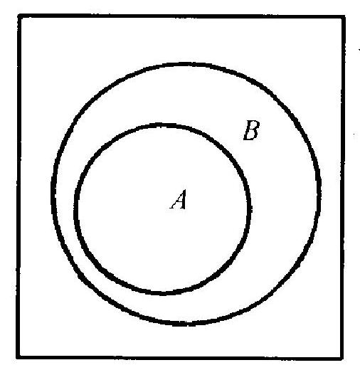
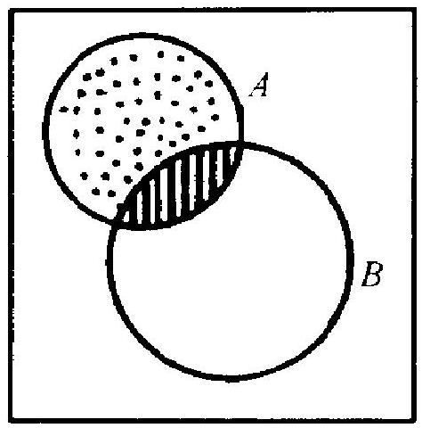
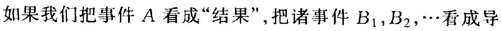

# 1.3 事件的运算、条件概率与独立性

<object data="https://eanyang7.github.io/Probability-and-Statistics/assets/1/1.3.pdf" type="application/pdf" width="700px" height="700px">
    <embed src="https://eanyang7.github.io/Probability-and-Statistics/assets/1/1.3.pdf">
        
This browser does not support PDFs. Please download the PDF to view it: <a href="https://eanyang7.github.io/Probability-and-Statistics/assets/1/1.3.pdf">下载 PDF</a>.

    </embed>
</object>
# 1.3 事件的运算、条件概率与独立性 

在实用上和理论上,下述情况常见: 问题中有许多比较简单的 事件, 其概率易于算出或是有了理论上的假定值,或是根据以往的 经验已对其值作了充分精确的估计. 而我们感兴趣的是一个复杂 的事件 $E$, 它通过种种关系与上述简单事件联系起来.这时我们 想设法利用这种联系，以便利用这些简单事件的概率去算出 $E$ 的 概率. 正如在微积分中, 直接利用定义可算出若干简单函数的导 数,但利用导数所满足的法则, 可据此算出很复杂的函数的导数.

例如,向一架飞机射击，事件 $E$ 是“击落这架飞机”. 设这架飞 机有一名驾驶员, 两个发动机 $G_{1}$ 和 $G_{2}$. 又假定当击中驾驶员, 或 同时击中两个发动机时, 飞机才被击落,记事件

$$
E_{0}=\text { 击中驾驶员, } E_{i}=\text { 击中 } G_{i}, i=1,2
$$

则 $E$ 与 $E_{0}, E_{1}, E_{2}$ 有关, 确切地说, $E$ 即由 $E_{0}, E_{1}, E_{2}$ 决定. 其关 系可通过文字表达如下:

$$
E=\left\{E_{0} \text { 发生或者 } E_{1}, E_{2} \text { 都发生 }\right\}
$$

这种表述很累赘,我们希望通过一些符号来表达,这就是本节要讨 论的事件的关系和运算. 对事件进行运算, 如同对数字作运算一 样: 对数字进行运算得出新的数, 而对事件作运算则得出新的事 件。

### 0.1. 1 事件的蕴含、包含及相等

在同一试验下的两事件 $A$ 和 $B$,如果当 $A$ 发生时 $B$ 必发生, 则称 $A$ 蕴含 $B$, 或者说 $B$ 包含 $A$, 记为 $A \subset B$. 若 $A, B$ 互相蕴含, 即 $A \subset B$ 且 $B \subset A$, 则称 $A, B$ 两事件相等,记为 $A=B$.

例如,搓两粒骰子。记

$$
\begin{aligned}
& A=\{\text { 郑出的点数之和大于 } 10\} \\
& B=\{\text { 至少有一粒骰子掷出 } 6\}
\end{aligned}
$$

若事件 $A$ 发生,易见 $B$ 非发生不可, 故 $A$ 蕴含 $B$. 一个形象的看 法如图 1.3. 向一个方形靶面射击, 以 $A, B$ 分别记“命中图中所标出的闭曲线 内部”的事件,则命中 $A$ 自意味着命中 $B$. 这个图形也说明了“ $B$ 包含 $A$ ”这个 说法的来由. 因从图中明白看出, $B$ 这 一块包含了 $A$ 这一块.

拿“事件是试验的一些结果” (见 1.1.2 段) 这个观点去看, 如果 $A$ 蕴含 $B$, 那只能是: $A$ 中的试验结果必在 $B$ 中,即 $B$ 这个集合 (作为试验结果的集

图 1.3 合)要大一些, “包含”一词即由此而来. 实际含义是: 若 $A \subset B$ (也 写为 $B \supset A$ ), 则 $A$ 和 $B$ 相比, 更难发生一些, 因而其概率就必然 小于或至多等于 $B$ 的概率. “两事件 $A, B$ 相等” 无非是说, $A, B$ 由完全同一的一些试验结果构成, 它不过是同一件事表面上看来 不同的两个说法而已.

例如,掷两个骰子,以 $A$ 记事件 “两骰子郑出点数奇偶不同”, $B$ 记事件 “拼出点数之和为奇数”. 这两个事件, 说法不同, 其实则 一. 对复杂情况则不必如此一目了然. 证明两事件 $A, B$ 相等的一 般方法是: 先设事件 $A$ 发生, 由此推出 $B$ 发生, 再反过来, 由假定 $B$ 发生推出 $A$ 发生. 这将在后面举例说明.

## 1. 3 .2 事件的互斥和对立

若两事件 $A, B$ 不能在同一次试验中都发生(但可以都不发 生), 则称它们是互斥的. 如果一些事件中任意两个都互斥, 则称这 些事件是两两互斥的,或简称互斥的.

例如，考虑投掷一个骰子这个试验. 记 $E_{i}$ 为事件 “郑出的点数 为 $i$ 的倍数”, $i=2,3,4$, 则 $E_{3}$ 与 $E_{4}$ 为互斥. 因若 $E_{4}$ 发生, 则只 有郑出 4 点, 而它非 3 的倍数, 即 $E_{3}$ 必不发生. 但是, $E_{2}$ 和 $E_{3}$ 并 非互斥. 因若抙出 6 点, 则二者同时发生. 简言之, 互斥事件即不两 立之事件.从“事件是由一些试验结果所构成的”这个观点看, 互斥 事件无非是说:构成这两个事件各自的试验结果中不能有公共的.

互斥事件的一个重要情况是“对立事件”, 若 $A$ 为一事件, 则 事件

$$
B=\{A \text { 不发生 }\}
$$

称为 $A$ 的对立事件,多记为 $\bar{A}$ (读作 $A b a r$, 也记为 $A^{c}$ ).

例娊，投拼一个骰子, 事件 $A=\{$ 掷出奇数点 $\}=\{1,3,5\}$ 的对 立事件是 $B=\{$ 掷出偶数点 $\}=\{2,4,6\}$. 对立事件也常称为“补事 件”. 拿上例来说,事件 $A$ 包含了三个试验结果: 1,3 和 5 , 而对立 事件 $B$ 中所含的三个试验结果 2,4 和 6 , 正好补足了前面三个, 以 得到全部试验结果.

## 2. 3 .3 事件的和(或称并)

设有两事件 $A, B$, 定义一个新事件 $C$ 如下:

$$
C=\{A \text { 发生,或 } B \text { 发生 }\}=\{A, B \text { 至少发生一个 }\}
$$

所谓定义一个事件, 就是指出它何时发生, 何时不发生. 现在这个 事件 $C$ 在何时发生呢? 只要 $A$ 发生, 或者 $B$ 发生(或二者同时发 生也可以), 就算是 $C$ 发生了, 不然 (即 $A, B$ 都不发生) 则算作 $C$ 不发生, 这样定义的事件 $C$ 称为事件 $A$ 与事件 $B$ 的和,记为

$$
C=A+B
$$

例如，郑一个骰子, 以 $A$ 记事件 $\{$ 郑出偶数点 $\}=\{2,4,6\}, B$ 记事件 $\{$ 瓶出 3 的倍数 $\}=\{3,6\}$, 则 $C$ $=A+B=\{2,3,4,6\}$, 即当郑出的点为 $2,3,4$ 或 6 时,事件 $C$ 发生,而郑出 1,5 时则不发生. 我们注意到, 两事件的和, 即把构成各事件的那些试验结果并“在 一起所构成的事件. 如把图 1.4 的正方 形视为一个平面靶, $A, B$ 两事件分别表 示命中图中所指闭曲线内部, 则 $C=$ $A+B$ 表示“命中由 $A, B$ 两闭曲线的外

图 1.4 缘所围成的区域”。这区域比 $A, B$ 都 大, 它由 $A, B$ 两部分合并而成. 当然, 作为集合, 重复的部分 (图 中斜线标出的部分) 只须计入一次.

这样, 若 $C=A+B$, 则 $A, B$ 都蕴含 $C, C$ 包含 $A$ 也包含 $B$. 经过相加, 事件变“大”了(含有更多的试验结果), 因而更容易发生 了.

事件的和很自然地推广到多个事件的情形.设有若干个事件 $A_{1}, A_{2}, \cdots, A_{n}$. 它们的和 $A$, 定义为事件

$$
\begin{aligned}
A & =\left\{A_{1} \text { 发生,或 } A_{2} \text { 发生, } \cdots, \text { 或 } A_{n} \text { 发生 }\right\} \\
& =\left\{A_{1}, A_{2}, \cdots, A_{n} \text { 至少发生一个 }\right\}
\end{aligned}
$$

且记为 $A_{1}+A_{2}+\cdots+A_{n}$ 或 $\sum_{i=1}^{n} A_{i}$ (也常记为 $\bigcup_{i=1}^{n} A_{i}$, 本书不用这 个记号). $A$ 是由把 $A_{1}, \cdots, A_{n}$ 所包含的全部试验结果并在一起所 得. 和的定义显然地推广到无限个事件的情形.

在此要不厌其烦地重复一点. 有的初学者对事件的运算感到 不易理解. 比如, 定义事件 $A, B$ 之和为 $C=\{A, B$ 至少发生其 一 . 他们问 : 既然已说 $A, B$ 至少要发生一个,那岂不是对 $A, B$

* 由于这个原因,事件的和也常称为事件的并,和 $A+B$ 也常被记为 $A \cup B$. “U” 这个记号有“合并”的含义, 由于称呼和书写上的少便, 本书中我们一直用“和”与 “+” 的说法, 也有些著作在当 $A, B$ 互斥时才把 $A \cup B$ 写成 $A+B$, 本书不采用这个做法. 作了限制? 不然, 我们不要忘记 1.1 节中所说的“事件不是指已发 生了的情况,而是某种情况的陈述”. 定义 $C$ 为“ $A, B$ 至少发生其 一”, 当然不是说 $A, B$ 已经或必然发生一个, 而是在试验时, 若 $A, B$ 至少发生了一个, 则算作 $C$ 发生了. 在任一次特定的试验 中, 当然可能 $A, B$ 都不发生, 这时 $C$ 也就不发生. 理解了这一点 就好办, 望读者多加留意.

### 2.1. 4 概率的加法定理

定理 3.1 若干个互斥事件之和的概率, 等于各事件的概率 之和:

$$
P\left(A_{1}+A_{2}+\cdots\right)=P\left(A_{1}\right)+P\left(A_{2}\right)+\cdots
$$

事件个数可以是有限的或无限的, 这定理就称为 (概率的) 加法定 理,其重要条件是各事件必须为两两互斥.

在概率的古典定义和统计定义之下, (3.1)很容易证明. 拿古 典定义来说, 设试验一共有 $N$ 个等可能的结果, 而有利于事件 $A_{1}, A_{2}, \cdots$ 发生的结果数分别为 $M_{1}, M_{2}, \cdots$, 则由于互斥性, 有利 于事件 $A=A_{1}+A_{2}+\cdots$ 发生的结果数, 应为 $M=M_{1}+M_{2}+\cdots$. 于是

$$
\begin{aligned}
P(A) & =\left(M_{1}+M_{2}+\cdots\right) / N=M_{1} / N+M_{2} / N+\cdots \\
& =P\left(A_{1}\right)+P\left(A_{2}\right)+\cdots
\end{aligned}
$$

对统计定义也完全类似地处理.

在概率论书籍中, 加法定理往往被称为加法公理, 即 (3.1) 是 不加证明而被接受的事实. 这条公理就是我们在 1.1.5 段中提到 而末加说明的,柯氏公理体系中的第 3 条.

读者可能会问: 既然在古典定义、统计定义这样在实用上重要 的概率定义之下, (3.1) 是可以证明的, 那么为什么要把它看作一 条公理? 问题在于: 你可以想像而且也确实可以建立一种概率理 论, 其中 (3.1) 不成立. 柯氏公理的意思是说: 我只考虑那种满足 (3.1) 的概率理论, 而不及其他. 正如在几何学中, 你可以把 “过不 在直线 $l$ 上的任一点只有一条与 $l$ 平行的直线" 作为公理, 由之建 立一套欧氏几何学, 也可以废弃这条公理而建立非欧几何学, 二者 都符合形式逻辑. 古典和统计定义之适合 (3.1), 不过是说明了: 它 们是柯氏公理体系中的东西.

加法定理 (3.1) 的一个重要推论如下:

系 3.1 以 $\bar{A}$ 表 $A$ 的对立事件,则

$$
P(\bar{A})=1-P(A)
$$

证明很容易. 以 $\Omega$ 记必然事件, 则按对立事件的定义有 $A+$ $\bar{A}=\Omega$ 且 $A$ 和 $\bar{A}$ 互斥. 因 $P(\Omega)=1$. 用 (3.1) 得 $1=P(\Omega)=P(A$ $+\bar{A})=P(A)+P(\bar{A})$, 即 $(3.2)$.

这个简单公式在概率计算上有用. 因为, 有时计算 $P(A)$ 不 易, 而 $P(\bar{A})$ 则易处理些.

### 2.2. 5 事件的积 (或称交)、事件的差

设有两事件 $A, B$, 则如下定义的事件 $C$

$$
C=\{A, B \text { 都发生 }\}
$$

称为两事件 $A, B$ 之积或乘积,并记为 $A B$. 拿图 1.4 的例子来说, 若分别以 $A, B$ 表示 “命中图中相应区域”的事件,则 $A B$ 就是事 件“命中图中斜线部分”. 又如骰子试验, 分别以 $A, B$ 记“撺出偶 数点”和“掷出素数点”之事件,则 $A B$ 就是事件 “掷出 2 点”.一般, 事件 $A, B$ 各是一些试验结果的集合,而 $A B$ 则由同属于这两个 集合的那些试验结果组成,即这两个集合的交叉 *按积的定义,两 个事件 $A, B$ 互斥,等于说 $A B$ 是不可能事件.

多个事件 $A_{1}, A_{2}, \cdots$ (有限或无限个都可以) 的积的定义类 似: $A=\left\{A_{1}, A_{2}, \cdots\right.$ 都发生 $\}$, 记为 $A=A_{1} A_{2} \cdots$,或 $\prod_{i=1}^{n} A_{i}$ (事件 个数有限) 或 $\prod_{i=1}^{\infty} A_{i}$ (事件个数无限).

* 由于这个原因,事件的积也常称为事件的交, 积 $A B$ 也常记为 $A \cap B$. “ “”这个 记号有取交的含义. 为书写方便, 本书一直用 $A B$ 这个记号. 两个事件 $A, B$ 之差,记为 $A-B$, 定义为

$$
A-B=\{A \text { 发生, } B \text { 不发生 }\}
$$

例如,则才提到的郑骰子试验中的两个事件 $A$ 和 $B, A-B=\{4$, 6). 在图 1.4 中, $A-B$ 就是 “命中图中用点标出的区域” 这个事 件.一般地, $A-B$ 就是从构成 $A$ 的那些试验结果中, 去掉在 $B$ 内 的那一些。很明显

$$
A-B=A \bar{B}
$$

其中 $\bar{B}$ 是 $B$ 的对立事件. 因为, $A \bar{B}$ 无非是说, $A, \bar{B}$ 都发生, 即 $A$ 发生 $B$ 不发生. 这样, 差可以通过积去定义.

我们对事件引进了和差积等运算,借用了算术中的名词. 但应 注意,算术的法则不一定能用于事件运算. 有些规则是成立的,例 如, 和 $A+B$ 及积 $A B$ 与次序无关: $A+B=B+A, A B=B A$, 这 由定义直接看出. 乘法结合律也成立: $(A B) C=A(B C)$ (它们都 等于 $A B C)$. 分配律也对, 例如:

$$
A(B-C)=A B-A C
$$

证明如下: 设在左边的事件发生, 则按积的定义, 事件 $A$ 和 $B-C$ 都发生. 按差的定义, $B$ 发生, $C$ 不发生. 因此, $A, B$ 同时发生而 $A, C$ 不同时发生, 故 $A B$ 发生而 $A C$ 不发生. 按差的定义, 即知 $A B-A C$ 发生. 反过来, 若右边的事件发生, 则 $A B$ 发生而 $A C$ 不 发生. 由前者知 $A, B$ 都发生, 由 $A$ 发生及 $A C$ 不发生, 知 $C$ 不发 生, 故 $B-C$ 发生. 因 $A$ 和 $B-C$ 都发生知 $A(B-C)$ 发生, 这证 明了 $(3.4)$.

这就是我们在本节 1.3.1 段末尾处指出的证明事件相等的一 般方法之一实例. 读者必须了解, 像 (3.3),(3.4)这类的等式, 不过 是反映了一种逻辑关系，因而必须用上述逻辑思维的方式去验证. 有些关系, 看来不习惯, 但逻辑上很简单. 例如, $A+A=A$ 而非 $2 A$ (2A 无意义) $A A=A$ 而非 $A^{2}$ ( $A^{2}$ 无意义), 由 $A-B=\varnothing($ 不 可能事件), 推不出 $A=B$, 而只能推出 $A \subset B$. 又如, $(A-B)+B$ 并不是 $A$ 而是 $A+B$ (请读者自证), 等等.

## 3. 3 .6 条件概率

一般讲,条件概率就是在附加一定的条件之下所计算的概率. 从广义的意义上说, 任何概率都是条件概率, 因为, 我们是在一定 的试验之下去考虑事件的概率的, 而试验即规定有条件. 在概率论 中, 规定试验的那些基础条件被看作是已定不变的.如果不再加入 其他条件或假定, 则算出的概率就叫做“无条件概率”, 就是通常所 说的概率. 当说到“条件概率”时, 总是指另外附加的条件, 其形式 可归峙为“已知某事件发生了”。

例如,考虑掷一个骰子的实验. 这里,骰子必须为均匀的正立 方体,抛郑要有足够的高度等要求, 是这试验的固有规定, 不作为 附加条件. 考虑三个事件: $A:$ “掷出素数点”, $B$ : “拼出奇数点”, $C$ : “掷出偶数点”, 有

$$
A=\{2,3,5\}, B=\{1,3,5\}, C=\{2,4,6\}
$$

于是算出 $A$ 的 (无条件) 概率为 $3 / 6=1 / 2$. 现若附加上“已知 $B$ 发 生”, 则可能情况只有三种: $1,3,5$, 其中两种有利于 $A$ 发生, 故在 这条件下, $A$ 的条件概率, 记为 $P(A \mid B)$, 等于 $2 / 3$. 同样, 在给定 事件 $C$ 发生的条件下, $A$ 的条件概率为 $P(A \mid C)=1 / 3$.

让我们在古典概率的模式下来分析一般的情况. 设一试验有 $N$ 个等可能结果, 事件 $A, B$ 分别包含其 $M_{1}$ 和 $M_{2}$ 个结果, 它们 有 $M_{12}$ 个是公共的,这就是事件 $A B$ 所包含的试验结果数. 若已给 $B$ 发生, 则我们的考虑由起先的 $N$ 个可能结果局限到现在的 $M_{2}$ 个, 其中只有 $M_{12}$ 个试验结果使事件 $A$ 发生, 故一个合理的条件 概率定义, 应把 $P(A \mid B)$ 取为 $M_{12} / M_{2}$. 但

$$
M_{12} / M_{2}=\left(M_{12} / N\right) /\left(M_{2} / N\right)=P(A B) / P(B)
$$

由此得出如下的一般定义:

定义 3.1 设有两事件 $A, B$ 而 $P(B) \neq 0$. 则“在给定 $B$ 发生 的条件下 $A$ 的条件概率”, 记为 $P(A \mid B)$, 定义为

$$
P(A \mid B)=P(A B) / P(B)
$$

当 $P(B)=0$ 时, (3.6) 无意义. 在高等概率论中, 也要考虑 $P(A \mid B)$ 当 $P(B)=0$ 时的定义问题, 那要夷涉到高深的数学, 超 出本书范围之外. 在后面我们也会和个别这种情况打交道,那可以 用极限的方法去处理.

(3.6) 是条件概率的一般定义, 但在计算条件概率时,并不一 定要有它. 有时, 直接从加人条件后改变了的情况去算, 更为方便. 举…个例子。

例 3.1 郑三个均勺骰子. 已知第一粒骰子掷出么点 (事件 $B)$. 问:“掷出点数之和不小于 10 ”这个事件 $A$ 的条件概率是多 少?

既然第一粒骰子已坐定了 1 , 则在这一条件下, 为使事件 $A$ 发生,第二、三粒骰子郑出点数之和不能小于9.这一情况有 10 种, 即 $36,63,45,54,46,64,55,56,65,66$. 这里 “36” 表示第二、三 粒骰子分别掷出 3 和 6 , 余类推, 这样, 得出 $P(A \mid B)=10 / 36=5$ / 18.

此题若直接用公式 (3.6) 计算, 则比上述解法复杂些, 读者可 一试以证明结果一致.

### 3.1. 7 事件的独立性,概率乘法定理

设有两事件 $A, B \cdot A$ 的无条件概率 $P(A)$ 与其在给定 $B$ 发生 之下的条件概率 $P(A \mid B)$, 一般是有差异的. 这反映了这两事件 之间存在着一些关联. 例如, 若 $P(A \mid B)>P(A)$, 则 $B$ 的发生使 $A$ 发生的可能性增大了: $B$ 促进了 $A$ 的发生.

反之, 若 $P(A)=P(A \mid B)$, 则 $B$ 的发生与否对 $A$ 发生的可 能性毫无影响 * . 这时在概率论上就称 $A, B$ 两事件独立, 而由 (3.6)得出

*这样说应补充: 由 $P(A)=P(A \mid B)$ 推出 $P(A)=P(A \mid \bar{B}), \bar{B}$ 为 $B$ 的对立事件. 事实上, 由 $P(A)=P(A \mid B)$ 及 (3.6) 知 $P(A B)=P(A) P(B)$. 因为 $A=A B+A \bar{B}$ 且 $A B, A \bar{B}$ 互斥, 知 $P(A \bar{B})=P(A)-P(A B)=P(A)-P(A) P(B)=P(A)(1-P(B))$ $=P(A) P(\bar{B})$. 故 $P(A \mid \bar{B})=P(A \bar{B}) / P(\bar{B})=P(A)$.

$$
P(A B)=P(A) P(B)
$$

拿此式来刻画独立性, 比用 $P(A)=P(A \mid B)$ 更好, 因 (3.7)不受 $P(B)$ 是否为 0 的制约 (当 $P(B)$ 为 0 时 (3.7) 必成立). 因此, 我们 取如下的定义:

定义 3.2 两事件 $A, B$ 若满足 (3.7), 则称 $A, B$ 独立.

定理 3.2 两独立事件 $A, B$ 的积 $A B$ 之概率 $P(A B)$ 等于其 各自概率之积 $P(A) P(B)$.

这个定理就是 (3.7) 式, 它称为 “概率的乘法定理”. 其实, 它就 是独立性的定义, 我们之所以又将它重复列出并标为一个定理, 就 是因为这个事实极其重要.

在实际问题中,我们并不常用 (3.7) 式去判断两事件 $A, B$ 是 否独立，而是相反: 从事件的实际角度去分析判断其不应有关联因 而是独立的,然后就可以用 (3.7). 例如,两个工人分别在两台机床 上进行生产, 彼此各不相干, 则各自是否生产出废品或多少废品这 类事件应是独立的.一城市中两个相距较远的地段是否出交通事 故,一个人的收人与其姓氏笔划, 这类事凭常识推想,认定为独立 的.

由此可知, 两事件有独立性多半是在下述情况之下产生的: 有 两个试验 $E_{1}$ 和 $E_{2}$, 其试验结果 (各有许多) 分别记之以 $e_{1}$ 和 $e_{2}$. 考虑一个“大”试验 $E$, 它由 $E_{1}, E_{2}$ 两部分构成 (故 $E$ 常称为复合 试验), 可记为 $E=\left(E_{1}, E_{2}\right)$, 其结果可记为 $\left(e_{1}, e_{2}\right)$. 在试验 $E$ 的 一个事件, 即是牵涉到 $\left(e_{1}, e_{2}\right)$ 的某一个陈述 (见 1.1.2). 如果 $A_{1}$, $A_{2}$ 是两个事件, $A_{1}$ 只牛涉 $e_{1}$ 而 $A_{2}$ 只牵涉 $e_{2}$, 则当两试验结果 如果彼此不影响时, $A_{1}, A_{2}$ 会有独立性. 可以举一个具体例子, 设 试验 $E_{1}$ 为鄚一个均匀骰子, 其试验结果 $e_{1}$ 有 6 个: $1,2, \cdots, 6$. 试 验 $E_{2}$ 为掷一个硬币, 其结果 $e_{2}$ 有两个: “正”和“反”. 定义两事件 $A_{1}, A_{2}$ :

$$
A_{1}=\{\text { 郑出 } 1 \text { 点 }\}, A_{2}=\{\text { 掷出正面 }
$$

这两个事件可看成同一试验 $E$ 下的两个事件, $E=\left\{E_{1}, E_{2}\right\}$, 它包 含 12 个可能结果：

$$
(1 \text {, 正 }),(1 \text {, 反 }),(2 \text {, 正 }),(2 \text {, 反 }), \cdots,(6 \text {, 正 }),(6 \text {, 反 })
$$

事件 $A_{1}$ 包含两个可能结果, 即 $\left\{(1\right.$, 正), (1, 反) $\}$, 而 $A_{2}$ 则包含 6 个可能结果: $\{(1$, 正 $),(2$, 正 $), \cdots,(6$,正 $)\}$, 通过这种方式,我们把 两个看来不相干的事件 $A_{1}$ 和 $A_{2}$ 统一在一个试验 $E$ 之下, 而其 独立性就好理解了一一即郑骰子和郑硬币彼此不影响而已. 这种 把若干个不相干的试验统一起来的做法, 看起来好像纯粹是一种 形式,但在理论上有其方便.

如果试验的内容真是单一的, 那么, 在这种试验下两事件独立 是较少出现的例外. 因为, 两个事件既然都依赖同一-批结果, 彼此 谅必会有影响. 郑两个均匀骰子, 以 $A_{i}$ 记 “点数和为 $i$ 的倍数”, $i=2,3,5$. 通过用 (3.7) 验证可知, $A_{2}$ 与 $A_{3}$ 独立, 但这非一般性 质, 比如, $A_{2}$ 与 $A_{5}$ 就不独立. 对这种“单一”性试验, (3.7) 作为验 证独立性的工具, 还是有用的. 有时, 末经周到考虑的直观也可能 引人歧途.

例 3.2 再考虑例 3.1 , 记 $B=\{$ 至少有一个骰子掷出 1$\}$,而 把事件 $A$ 定义为 $A=\{$ 三个骰子抙出的点数中至少有两个一样 (即不全相异) $\}$, 问 $A, B$ 是否独立?

初一看使人的倾向于相信 $A, B$ 独立, 理由如下: 知道 $B$ 发 生, 即知道掷出的点中有 1 , 对 $A$ 而言, 似与知道掷出的点中有 2 (或 3,4,5,6 都可以)一样. 故 1 这个数并不相对地更有利于或更 不利于 $A$ 发生. 经过计算发现不然: $A, B$ 并不独立. 这一点看来 有些难理解, 但是, 如按下述分析, 则可以信服: 考虑 $\bar{B}$. 若 $\bar{B}$ 发 生, 则三个骰子都不出么. 这样, 它们都只有 5 种可能性 $(2,3,4,5$, 6), 比不知 $\bar{B}$ 发生时可能取的点数 $1,2,3,4,5,6$ 少了一个, 在 5 个 数中拿 3 个 (每个可重复拿), 其有两个一样的可能性, 自应比在 6 个数中拿 3 个时, 有两个一样的可能性要大些. 这个分析指出应有 $P(A)<P(A \mid \widetilde{B})$, 由此推出 $P(A)>P(A \mid B)$ (见习题 15 ), $A, B$ 不独立.

多个事件独立性的定义,就是两个事件情况的直接推广.

定义 3.3 设 $A_{1}, A_{2}, \cdots$ 为有限或无限个事件. 如果从其中任 意取出有限个 $A_{i_{1}}, A_{i_{2}}, \cdots, A_{i_{m}}$ 都成立.

$$
P\left(A_{i_{1}} A_{i_{2}} \cdots A_{i_{m}}\right)=P\left(A_{i_{1}}\right) P\left(A_{i_{2}}\right) \cdots P\left(A_{i_{n}}\right)
$$

则称事件 $A_{1}, A_{2}, \cdots$ 相互独立或简称独立.

这个定义与由条件概率出发的定义是等价的, 后者是说: 对任 何互不相同的 $i_{1}, i_{2}, \cdots, i_{m}$, 有

$$
P\left(A_{i_{1}} \mid A_{i_{2}} \cdots A_{i_{m}}\right)=P\left(A_{i_{1}}\right)
$$

即任意事件 $A_{i_{1}}$ 发生的可能性大小, 不受其他事件发生的影响. 这 更接近于独立性的原义. 但是, (3.9) 的左边依赖于 $P\left(A_{i_{2}} \cdots A_{i_{m}}\right)$ $>0$, 否则无意义, 而 (3.8) 就没有这个问题. 另外, 定理 3.2 后面说 的那段话当然也适用于多个事件的情形: 多个事件的独立性往往 产生于由多个试验构成的复合试验中, 每个事件只与其中一个试 验有关.

由独立性定义立即得出下面的概率乘法定理：

定理 3.3 若干个独立事件 $A_{1}, \cdots, A_{n}$ 之积的概率,等于各 事件概率的乘积:

$$
P\left(A_{1} \cdots A_{n}\right)=P\left(A_{1}\right) \cdots P\left(A_{n}\right)
$$

乘法定理的作用与加法定理一样: 把复杂事件的概率的计算 归结为更简单的事件概率的计算, 这当然要有条件: 相加是互斥, 相乘是独立.

由独立性定义可得到下面两条重要推论.

系 3.2 独立事件的任一部分也独立. 例如, $A, B, C, D$ 四事 件相互独立,则 $A, C$, 或 $A, B, D$ 等,都是独立的.

这一点由独立性定义直接推出. 更进一步可推广为: 由独立事 件决定的事件也独立.举例来说, 若事件 $A_{1}, \cdots, A_{6}$ 相互独立, 则 以下三事件

$$
B_{1}=A_{1}+A_{2}, B_{2}=A_{3}-A_{4}, A_{3}=A_{5} A_{6}
$$

也独立. 这在直观上很显然, 但证明起来很麻烦, 因为可以产生的 事件很多. 在下一章中我们将指出另外的考虑方法 (见第二章例 3.7). 如果把 $B_{3}$ 改为 $A_{4} A_{5} A_{6}$, 则 $B_{2}, B_{3}$, 就不一定独立了. 理由 也很明显:二者都与 $A_{4}$ 有关，因而彼此也就有了关系．

系 3.3 若一列事件 $A_{1}, A_{2}, \cdots$ 相互独立, 则将其中任一部分 改为对立事件时, 所得事件列仍为相互独立.

例如, 若 $A_{1}, A_{2}, A_{3}$ 相互独立, 则 $\bar{A}_{1}, A_{2}, A_{3}$, 或 $\bar{A}_{1}, A_{2}, \bar{A}_{3}$, 或 $\bar{A}_{1}, \overline{A_{2}}, \overline{A_{3}}$ 等, 都是互相独立的.

这一点从直观上也很显然, 且对两个事件的情况, 已在 27 页 的足注中作过证明. 让我们再看一个三个事件的例子. 比如, 要证 $\bar{A}_{1}, A_{2}, \bar{A}_{3}$ 独立, 要对其验证 (3.8), 其中有 $P\left(\bar{A}_{1} A_{2} \bar{A}_{3}\right)=$ $P\left(\bar{A}_{1}\right) P\left(A_{2}\right) P\left(\bar{A}_{3}\right)$. 为此注意

$$
A_{2} \bar{A}_{3}=A_{1} A_{2} \bar{A}_{3}+\bar{A}_{1} A_{2} \bar{A}_{3}
$$

且右边两事件互斥, 故

$$
\begin{aligned}
P\left(\bar{A}_{1} A_{2} \bar{A}_{3}\right) & =P\left(A_{2} \bar{A}_{3}\right)-P\left(A_{1} A_{2} \bar{A}_{3}\right) \\
& =P\left(A_{2}\right) P\left(\bar{A}_{3}\right)-P\left(A_{1} A_{2} \bar{A}_{3}\right)
\end{aligned}
$$

再利用 $A_{1} A_{2}=A_{1} A_{2} A_{3}+A_{1} A_{2} \bar{A}_{3}$, 得

$$
\begin{aligned}
P\left(A_{1} A_{2} \bar{A}_{3}\right) & =P\left(A_{1} A_{2}\right)-P\left(A_{1} A_{2} A_{3}\right) \\
& =P\left(A_{1}\right) P\left(A_{2}\right)-P\left(A_{1}\right) P\left(A_{2}\right) P\left(A_{3}\right) \\
& =P\left(A_{1}\right) P\left(A_{2}\right)\left(1-P\left(A_{3}\right)\right) \\
& =P\left(A_{1}\right) P\left(A_{2}\right) P\left(\bar{A}_{3}\right)
\end{aligned}
$$

以此代人(3.12), 得

$$
\begin{aligned}
P\left(\bar{A}_{1} A_{2} \bar{A}_{3}\right) & =P\left(A_{2}\right) P\left(\bar{A}_{3}\right)-P\left(A_{1}\right) P\left(A_{2}\right) P\left(\bar{A}_{3}\right) \\
& =\left(1-P\left(A_{1}\right)\right) P\left(A_{2}\right) P\left(\bar{A}_{3}\right) \\
& =P\left(\bar{A}_{1}\right) P\left(A_{2}\right) P\left(\bar{A}_{3}\right)
\end{aligned}
$$

明所欲证. 可以看出: 当涉及众多的事件时, 这么处理会很冗长, 但 并无任何实质困难 (可使用数学归纳法, 对所含对立事件个数进行 归纳).

除了相互独立之外, 还有所谓“两两独立” 的概念. 一些事件 $A_{1}, A_{2}, \cdots$, 如果其中任意两个都独立, 则称它们两两独立. 由相互 独立必推出两两独立, 反过来不一定对. 从数学上, 这无非是说: 由 (3.8) 对 $m=2$ 及任何 $i_{1} \neq i_{2}$ 成立, 不必能推出该式当 $m>2$ 时 也成立.下面是一个简单的例子:

例 3.3 有四个大小质地一样的球, 分别在其上写上数字 1, 2,3 和 “ $1,2,3$ ”, 即第 4 个球上 $1,2,3$ 这三个数字都有. 引进三个 事件:

$$
A_{i}=\{\text { 随机抽出一球, 球上有数字 } i\}, i=1,2,3
$$

所谓随机抽出一球, 即每球被抽出的概率都是 $1 / 4$. 易见 $P\left(A_{1}\right)=$ $P\left(A_{2}\right)=P\left(A_{3}\right)=1 / 2$. 因为, 为使事件 $A_{1}$ 发生, 必须抽出第一球 或第四球, 有 2 种可能. 又 $P\left(A_{1} A_{2}\right)=P\left(A_{1} A_{3}\right)=P\left(A_{2} A_{3}\right)=$ $1 / 4$. 因为, 要 $A_{1}, A_{2}$ 同时发生 (抽出的球上既有 1 又有 2 ), 必须 抽出第四球. 这样, 对任一对事件 $A_{i}, A_{j}$, 都有 $1 / 4=P\left(A_{i} A_{j}\right)=$ $P\left(A_{i}\right) P\left(A_{j}\right)$, 而 $A_{1}, A_{2}, A_{3}$ 为两两独立.

但 $A_{1}, A_{2}, A_{3}$ 不是相互独立. 因为, 易见 $P\left(A_{1} A_{2} A_{3}\right)$ 也是 $1 / 4$, 而 $P\left(A_{1}\right) P\left(A_{2}\right) P\left(A_{3}\right)$ 为 $1 / 8$, 二者不相等.

在现实生活中,难于想像两两独立而不相互独立的情况. 可以 这样想: 独立性毕竟是一个数学概念, 是现实世界中通常理解的那 种“独立性”的一种数学抽象, 它难免会有些不尽人意的地方.

独立性的概念在概率论中极端重要. 较早期 (比方说,到上世 纪 30 年代止)的概率论发展中, 它占据了中心地位. 时至今日, 有 不少非独立的理论发展了起来, 但其完善的程度仍不够. 而且, 独 立性的理论和方法也是研究非独立模型的基础和工具. 在实用上, 确有许多事件其相依性很小, 在误差容许的范围内, 它们可视为独 立的,而方便于问题的解决.

利用本节中引进的事件运算,独立性概念,加法乘法定理,可 计算一些较复杂事件的概率. 举几个例子.

例 3.4 考虑本节开始处提到的那个“打飞机”的例子. 按所 作规定, “飞机被击落”这事件 $E$ 可表为

$$
E=E_{0}+E_{1} E_{2}
$$

设 $E_{0}, E_{1}, E_{2}$ 三事件独立. 这假定从实际角度看还算合理. 记 $E_{0}$, $E_{1}, E_{2}$ 的概率分别为 $p_{0}, p_{1}, p_{2}$. 为算 $E$ 的概率 $P(E)$, 不能直接 用加法定理, 因 $E_{0}$ 与 $E_{1} E_{2}$ 并非互斥, 考虑 $\bar{E}$, 易见 $\bar{E}=\bar{E}_{0} \overline{E_{1} E_{2}}$. 因 $E_{0}, E_{1}, E_{2}$ 独立, 按系 3.2 后面指出的, $\bar{E}_{0}$ 和 $\overline{E_{1} E_{2}}$ 独立, 故

$$
P(\bar{E})=P\left(\bar{E}_{0}\right) P\left(\overline{E_{1} E_{2}}\right)
$$

有 $P\left(\bar{E}_{0}\right)=1-P\left(E_{0}\right)=1-p_{0}, P\left(\overline{E_{1} E_{2}}\right)=1-P\left(E_{1} E_{2}\right)=1-$ $P\left(E_{1}\right) P\left(E_{2}\right)=1-p_{1} p_{2}$. 代人上式得 $P(\bar{E})=\left(1-p_{0}\right)(1-$ $\left.p_{1} p_{2}\right)$, 而

$$
\begin{aligned}
P(E) & =1-P(\bar{E})=1-\left(1-p_{0}\right)\left(1-p_{1} p_{2}\right) \\
& =p_{0}+p_{1} p_{2}-p_{0} p_{1} p_{2}
\end{aligned}
$$

例 3.5 甲、乙二人下象棋, 每局甲胜的概率为 $a$, 乙胜的概 率为 $b$, 为简化问题, 设没有和局的情况,这意味着 $a+b=1$.

设想甲的棋艺高于乙, 即 $a>b$. 考虑到这一点, 他们商定最终 胜负的规则如下: 到什么时候为止甲连胜了三局而在此之前乙从 末连胜二局, 则甲胜. 反之, 若到什么时候为止乙连胜了二局而在 此之前甲从末连胜三局, 则乙胜. 现要求 “甲最终取胜”这事件 $A$ 的概率 $P(A)$, 及“乙最终取胜”这事件 $B$ 的概率 $P(B)$.

为方便计, 分别以 $E$ 和 $F$ 表甲、乙在特定的一局取胜的事件, 有 $P(E)=a, P(F)=b$, 现考虑“甲取胜”的事件 $A$, 分两种情况.

1. 第一局甲胜而最终甲胜了.

这一情况又可分解为许多子情况: 对 $n=0,1,2 \cdots$, 甲经过 $n$ 个“阶段” 后才取胜, 每个阶段是 $E F$ 或 $E E F$, 然后接着来一个 $E E E$. 例如, 甲经过 4 个阶段后获胜的一种可能实战结果为

## 4. EEF EF EEF EEE

即共下了 11 局甲才获胜, 其中第 $1,2,4,6,7,9,10,11$ 局甲胜, 其 余乙胜.

每个阶段不是 $E F$ 就是 $E E F$, 这两种情况互斥, 又由独立性, 知每个阶段概率为 $a b+a a b=a b(1+a)$. 再由独立性, 知“经 $n$ 阶 段后甲获胜”的概率, 为 $[a b(1+a)]^{n} a^{3} \cdot n$ 可以为 $0,1,2, \cdots$, 不同 的 $n$ 互斥. 于是这部分概率总和为

$$
p=a^{3} \sum_{n-0}^{\infty}[a b(1+a)]^{n}=a^{3} /[1-a b(1+a)]
$$

2. 第一局乙胜而最终甲胜了.

既然第一局为 $F$ 而最终甲胜, 第二局必须是 $E$, 故从第二局 作起点看. 我们回到了情况 1 , 从而这部分的概率为 $b p$ (请读者注 意, 这里事实上已用了概率的乘法定理: $P$ (第一局乙胜且最终甲 胜) $=P$ (第一局乙胜) $P$ (第二同甲胜且最终甲胜), 第一项为 $b$ 而 后一项为 $p$. 总合两个情况 (它们互斥), 用加法定理, 得

$$
P(A)=a^{3}(1+b) /[1-a b(1+a)]
$$

直观上我们觉得, 这个竟赛无限期拖下去分不出胜负是不可 能的, 这意味着 $P(B)=1-P(A)$. 可是, 上述直观看法仍须证明, 不如直接算. 方法与算 $P(A)$ 一样, 但须分三种情况: (1) 第一局乙 胜. (2)第一局甲胜, 第二局乙胜. (3)前两局甲胜, 我们把具体计算留 给读者 (习题 16) , 结果为

$$
P(B)=\left(1+\bar{a}+a^{2}\right) b^{2} /[1-a b(1+a)]
$$

由于 $a+b=1$, 极易验证 $P(A)+P(B)=1$.

这个例子值得细心品味. 第一, 它提供了一个涉及到无限个事 件的情况 (在甲最终取胜前可以经过任意多的“阶段”)，以及在无 穷个事件时使用加法定理 (3.1). 第二, 本例告诉我们, 在面对一个 复杂事件时, 主要的方法是冷静地分析以设法把它分拆成一些互 斥的简单情况. 这里, 必须细心确保互斥性又无遗漏, 一着不慎, 满 盘皆非.

例 3.6 设一个居民区有 $n$ 个人, 设有一个邮局, 开 $c$ 个窗 口, 设每个窗口都办理所有业务. $c$ 太小, 经常排长队; $c$ 太大又不 经济.

现设在每一指定时刻, 这 $n$ 个人中每一个是否在邮局是独立 的, 每人在邮局的概率都是 $p$. 设计要求: “在每一时刻每窗口排队 人数 (包括正在被服务的那个人) 不超过 $m$ ”这个事件的概率, 要 不小于 $a$ (例如, $a=0.80,0.90$ 或 0.95$)$. 问至少须设多少窗口?

把 $n$ 个人编号为 $1, \cdots, n$, 记事件 $E_{i}=\{$ 在指定时刻第 $i$ 个人在邮局办事 $\}, i=1, \cdots, n$ 则在指 定时刻,邮局的具体情况可以用形如

$$
E_{1} \bar{E}_{2} E_{3} E_{4} E_{5} \bar{E}_{6} \bar{E}_{7} E_{8} \cdots \bar{E}_{i} \cdots E_{n-1} \bar{E}_{n}
$$

这种事件去描述之. 为了每个窗口排队人数都不超过 $m$, 在上述 序列中, 不加“bar”的 $E$ 的个数, 至多只能是 $\mathrm{cm}$. 现固定一个 $k \leqslant$ $\mathrm{cm}$, 来求 “在 (3.15) 中恰有 $k$ 个不加 bar 的 $E$ ” 这事件 $B_{k}$ 的概率. 由独立性以及 $P\left(E_{i}\right)=p, P\left(\bar{E}_{i}\right)=1-p$, 知每个像 (3.15) 那样的 序列且不加 bar 的 $E$ 恰有 $k$ 个时, 概率为 $p^{k}(1-p)^{n-k}$. 但 $k$ 个不 加 bar 的位置, 可以是 $n$ 个位置中的任何 $k$ 个. 因此, 一共有 $\left(\begin{array}{l}n \\ k\end{array}\right)$ 个形如(3.15)的序列, 其中不加 bar 的 $E$ 恰有 $k$ 个, 这样得 到 $P\left(B_{k}\right)=\left(\begin{array}{l}n \\ k\end{array}\right) p^{k}(1-p)^{n-k}$. 由于 $k$ 可以为 $0,1, \cdots, c m$, 且不同 的 $k$ 对应的 $B_{k}$ 互斥, 故得

$P($ 每个窗口排队人数不超过 $m)=\sum_{k=0}^{c m}\left(\begin{array}{l}n \\ k\end{array}\right) p^{k}(1-p)^{n-k}$

找一个最小的自然数 $c$, 使上式不小于指定的 $a$, 就是问题的答 案.

这是一个有现实意义的例题. 在 $n$ 较大时, 可用更方便的近 似方法确定 $c$, 参见第三章例 4.1. 当然, 实际问题比本例描述的要 复杂得多, 因为有一个每人服务时间长短的问题. 这时间长短并非 固定而是随机的. 这类问题属于排队论, 是运筹学的一个分支. 本 例是运筹学与概率论有联系的一个例子.

### 4.1. 8 全概率公式与贝叶斯公式

全概率公式

设 $B_{1}, B_{2}, \cdots$ 为有限或无限个事件, 它们两两互斥且在每次 试验中至少发生一个.用式表之,即

$$
B_{i} B_{j}=\varnothing \text { (不可能事件), 当 } i \neq j
$$

$$
B_{1}+B_{2}+\cdots=\Omega \text { (必然事件) }
$$

有时把具有这些性质的一组事件称为一个“完备事件群”, 注意, 任 一事件 $B$ 及其对立事件组成一个完备事件群.

现考虑任一事件 $A$. 因 $\Omega$ 为必然事件, 有 $A=A \Omega=A B_{1}+$ $A B_{2}+\cdots$. 因 $B_{1}, B_{2}, \cdots$ 两两互斥, 显然 $A B_{1}, A B_{2}, \cdots$ 也两两互斥. 故依加法定理 3.1 , 有

$$
P(A)=P\left(A B_{1}\right)+P\left(A B_{2}\right)+\cdots
$$

再由条件概率的定义, 有 $P\left(A B_{i}\right)=P\left(B_{i}\right) P\left(A \mid B_{i}\right)$. 代入上式得

$$
P(A)=P\left(B_{1}\right) P\left(A \mid B_{1}\right)+P\left(B_{2}\right) P\left(A \mid B_{2}\right)+\cdots
$$

公式 (3.18) 就称为 “全概率公式”. 这名称的来由, 从公式(3.17) 和 (3.18) 可以悟出: “全部”概率 $P(A)$ 被分解成了许多部分之和. 它 的理论和实用意义在于: 在较复杂的情况下直接算 $P(A)$ 不易, 但 $A$ 总是随某个 $B_{i}$ 伴出, 适当去构造这一组 $B_{i}$ 往往可以简化计算. 这种思想应用的一个实例是例 3.5 中算 “乙最终获胜” 这事件 $A$ 的概率.我们在该例中已指出: $A$ 必伴随以下三种互斥情况之一 而发生:乙; 甲乙; 甲甲. 只是该例的特殊性使我们可只用加法定理 而不必求助于全概率公式.

这公式还可以从另一个角度去理解. 把 $B_{i}$ 看作为导致事件 $A$ 发生的一种可能途径. 对不同途径, $A$ 发生的概率即条件概率 $P(A \mid B)$ 各各不同, 而采取哪个途径却是随机的. 直观上易理解: 在这种机制下, $A$ 的综合概率 $P(A)$ 应在最小的 $P\left(A \mid B_{i}\right)$ 和最大 的 $P\left(A \mid B_{i}\right)$ 之间, 它也不一定是所有 $P(A \mid B)$ 的算术平均, 因为 各途径被使用的机会 $P\left(B_{i}\right)$ 各各不同, 正确的答案如所预期, 应 是诸 $P\left(A \mid B_{i}\right), i=1,2, \cdots$, 以 $P\left(B_{i}\right), i=1,2, \cdots$ 为权的加权平均 值. 一个形象的例子如下: 某中学有若干个毕业班, 各班升学率不 同. 其总升学率, 是各班升学率的加权平均, 其权与各班学生数成 比例. 又如若干工厂生产同一产品, 其废品率各各不同. 若将各厂 产品汇总, 则总废品率为各厂废品率之加权平均, 其权与各厂产量 成比例. 再举一个例.

例 3.7 设一个家庭有 $k$ 个小孩的概率为 $p_{k}, k=0,1,2, \cdots$, 又设各小孩的性别独立. 且生男、女孩的概率各为 $1 / 2$. 试求事件 $A=\{$ 家庭中所有小孩为同一性别 $\}$ 的概率.

引进事件 $B_{k}=\{$ 家庭中有 $k$ 个小孩 $\}$, 则 $B_{0}, B_{1}, \cdots$ 构成完备 事件群, $P\left(B_{k}\right)=p_{k}$, 现考虑 $P\left(A \mid B_{k}\right)$. 约定当 $k=0$ 时其值为 1 . 若 $k \geqslant 1$, 则 $k$ 个小孩性别全同有两种可能: 全为男孩, 概率 $(1 / 2)^{k}$; 全为女孩,概率也是 $(1 / 2)^{k}$. 因

$$
P\left(A \mid B_{k}\right)=2(1 / 2)^{k}=1 / 2^{k-1}, k \geqslant 1
$$

由此, 用全概率公式, 得出

$$
P(A)=p_{0}+\sum_{k=1}^{\infty} p_{k} / 2^{k-1}
$$

贝叶斯公式

在全概率公式的假定之下, 有

$$
\begin{aligned}
P(B \mid A) & =P\left(A B_{i}\right) / P(A) \\
& =P\left(B_{i}\right) P\left(A \mid B_{i}\right) / \sum_{j} P\left(B_{j}\right) P\left(A \mid B_{j}\right)
\end{aligned}
$$

这个公式就叫做贝叶斯公式, 是概率论中的一个著名的公式. 这个 公式首先出现在英国学者 T. 贝叶斯 $(1702 \sim 1761)$ 去世后的 1763 年的一项著作中.

从形式推导上看, 这个公式平淡无奇, 它不过是条件概率定义 与全概率公式的简单推论. 其所以著名, 在其现实以至哲理意义的 解释上: 先看 $P\left(B_{1}\right), P\left(B_{2}\right), \cdots$, 它是在没有进一步的信息 (不知 事件 $A$ 是否发生) 的情况下, 人们对诸事件 $B_{1}, B_{2}, \cdots$ 发生可能性 大小的认识. 现在有了新的信息 (知道 $A$ 发生), 人们对 $B_{1}, B_{2}, \cdots$ 发生可能性大小有了新的估价. 这种情况在日常生活中也是屡见 不鲜的: 原以为不甚可能的一种情况, 可以因某种事件的发生而变 得甚为可能, 或者相反. 贝叶斯公式从数量上刻画了这种变化.

致这结果的可能的“原因”, 则可以形象地把全概率公式看作成为 “由原因推结果”; 而贝叶斯公式则恰好相反, 其作用在于 “由结果 推原因”:现在有一个“结果” $A$ 已发生了, 在众多可能的“原因” 中, 到底是哪一个导致了这结果? 这是一个在日常生活和科学技 术中常要问到的问题. 贝叶斯公式说, 各原因可能性大小与 $P\left(B_{i}\right.$ (A) 成比例. 例如, 某地区发生了一起刑事案件,按平日掌握的资 料, 嫌疑人有张三、李四……等人, 在不知道案情细节 (事件 $A$ ) 之 前, 人们对上述诸人作案的可能性有个估计 (相当于 $P\left(B_{1}\right)$, $\left.P\left(B_{2}\right) \cdots\right)$, 那是基于他们过去在局子里的记录. 但在知道案情细 节以后, 这个估计就有了变化, 比方说, 原来以为不甚可能的张三, 现在成了重点嫌疑人.

由以上的讨论也不难看出此公式在统计上的作用. 在统计学 中, 是依靠收集的数据 (相当于此处的事件 $A$ ) 去寻找所感兴趣的 问题的答案. 这是一个“由结果找原因”性质的过程, 故而贝叶斯公 式有用武之地. 事实上,依据这个公式的思想发展了一整套统计推 断方法, 叫做“贝叶斯统计”. 在本书后面的章节中将论及贝叶斯统 计中的某些方法.

下述简单例子可能有助于理解上述论点.

例 3.8 有三个盒子 $C_{1}, C_{2}, C_{3}$, 各有 100 个球, 其中 $C_{1}$ 盒含 白球 80 个, 红球 10 个, 黑球 10 个; $C_{2}$ 为白 10 、红 80 、黑 $10 ; C_{3}$ 为 白 10 ,红 10 ,黑 80 . 现从这三盒中随机地抽出一个(每盒被抽的概 率为 $1 / 3$ ), 然后从所抽出的盒中随机抽出一个球 (每球被抽的概 率为 0.01 ), 结果抽出者为白球. 问 “该白球是从 $C_{i}$ 盒中抽出”的 可能性有多大? $i=1,2,3$.

记 $B_{i}=$ 抽出的为 $C_{i}$ 盒 $\}, i=1,2,3 ; A=\{$ 抽出白球 $\}$, 要求 的是条件概率 $P\left(B_{i} \mid A\right)$. 按假定有

$$
\begin{aligned}
& P\left(B_{1}\right)=P\left(B_{2}\right)=P\left(B_{3}\right)=1 / 3 \\
& P\left(A \mid B_{1}\right)=0.8, P\left(A \mid B_{2}\right)=0.1, P\left(A \mid B_{3}\right)=0.1
\end{aligned}
$$

代人(3.18), 算出

$$
P\left(B_{1} \mid A\right)=0.8, P\left(B_{2} \mid A\right)=0.1, P\left(B_{3} \mid A\right)=0.1
$$

因为 $C_{1}$ 盒所含白球最多, 故在已知抽出白球的情况下, 该球 系来自 $C_{1}$ 盒的可能性也最大, 理所当然. 可能仍有读者不完全了 然于心, 则可以设想这么一个试验: 准备两张纸, 把例中的试验一 次又一次的做下去: 每抽出一个盒, 在左边的纸上记下其为 $C_{1}$ 或 $C_{2}$ 或 $C_{3}$ (不管从该盒中抽出的球如何), 而只有在抽出的球为白 球时,才在右边纸上记下该盒为 $C_{1}$ 或 $C_{2} 、 C_{3}$. 在进行了极大量次 数试验后, 会发现左边纸上 $C_{1}$ 的比例很接近 $1 / 3$, 而在右边纸上 $C_{1}$ 的比例则很接近 0.8 .

例 3.9 设某种病菌在人口中的带菌率为 0.03 . 当检查时, 由 于技术及操作之不完善以及种种特殊原因, 使带菌者末必检出阳 性反应而不带菌者也可能呈阳性反应.假定

$P($ 阳性 $\mid$ 带菌 $)=0.99, P($ 阳性 $\mid$ 带菌 $)=0.01$

$P($ 阳性 $\mid$ 不带菌 $)=0.05, P($ 阴性 $\mid$ 不带菌 $)=0.95$

现设某人检出阳性,问 “他带菌”的概率是多少?

此问题相当于 $P\left(B_{1}\right)=0.03, P\left(B_{2}\right)=0.97$, 且

$$
P\left(A \mid B_{1}\right)=0.99, P\left(A \mid B_{2}\right)=0.05
$$

所求的概率为 $P\left(B_{1} \mid A\right)$. 按公式 (3.18) 算出

$$
(0.03)(0.99) /[(0.03)(0.99)+(0.97)(0.05)]=0.380
$$

就是说, 即使你检出阳性, 尚可不必过早下结论你一定带菌了, 实 际上这种可能性尚不到百分之四十。

这个例子很值得玩味, 且对其“思维定势”中无概率成分的人 来说, 简直有点难以置信. 说穿了, 理由简单之极. 由于带菌率极 低, 在全人口中绝大部分不带菌. 由于检验方法之不完善, 在这大 批人中会检出许多呈阳性者. 另一方面, 带菌者在全人口中很少, 即使全检出呈阳性, 在这两部分呈阳性者的总和中也只占相对较 小的一部分, 而大部分属于 “虚报” 性质. 这个例子说明，提高精确 度在这类检验中极为重要。

一个不慬概率的人可能会这样推理: 由于不带菌时检出阳性 的机会才 0.05 . 我现在呈阳性, 说明我有 $1-0.05=0.95$ 的机会 带菌. 实际不然. 大而言之, 概率思维是人们正确观察事物而必备 的文化修养,这样说也许并不过分!

