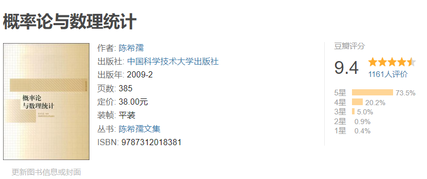

# 简

 

## 内容简介 

本书内容包括初等概率计算、随机变量及其分布、数字特征、多维随机向量、极限定理、统计学基本概念、点估计与区间估计、假设检验、回归相关分析、方差分析等。书中选入了部分在理论和应用上重要，但一般认为超出本课程范围的材料，以备教者和学者选择。本书着重基本概念的阐释，同时在设定的数学程度内，力求做到论述严谨。书中精选了百余道习题，并在书末附有提示与解答。

本书可作为高等学校理工科非数学系的概率统计课程教材，也可供具有相当数学准备（初等微积分及少量矩阵知识）的读者自修之用。

## 作者简介

陈希孺，数学家，中国科学院院士（已故）。主要从事数理统计的研究。他在统计工作中深入应用分析数学工具，一些估计达到较高精密程度。他在线性回归大样本理论、非参数理论等方面都有贡献。他长时间在中国科学技术大学工作，培养与影响了不少数理统计学家。

